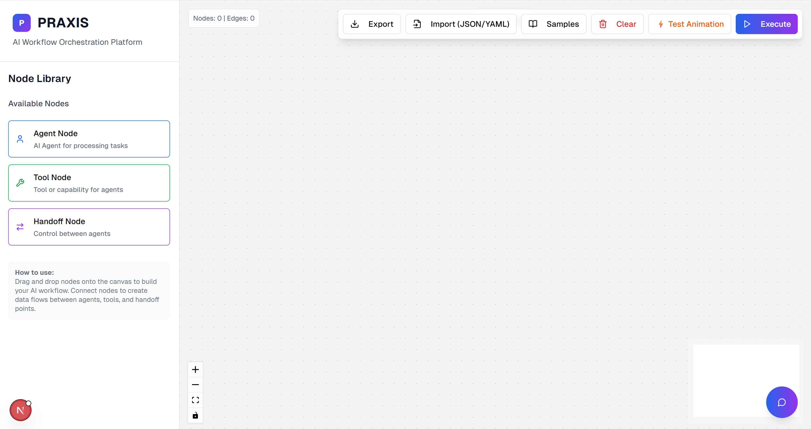
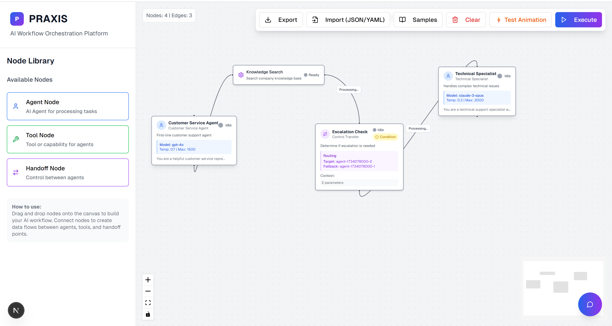

# Praxis No-Code Builder: User-Guide

Welcome to **Praxis**, a visual workflow builder for the P2P Agent Network. This guide will walk you through creating your first AI-powered workflow.

## Step 1: Getting Started

### Install and Run
1. **Install dependencies:**
   ```bash
   npm install
   ```

2. **Start the application:**
   ```bash
   npm run dev
   ```

3. **Open your browser:**
   Navigate to `http://localhost:3000`

### Prerequisites
Make sure your Praxis P2P agents are running:
- Orchestrator Agent: `http://localhost:8000`
- Filesystem Agent: `http://localhost:8001`
- WebSocket: `ws://localhost:9100`

## Step 2: Understanding the Interface

When you open Praxis, you'll see:
- **Left Panel**: Node library with Agent, Tool, and Handoff nodes
- **Center Canvas**: Where you build your workflow
- **Right Panel**: Node configuration and execution monitoring
- **Top Panel**: Buttons for control workflow, also import/export and example workflows



## Step 3: Create Your First Workflow

Let's build a simple file processing workflow:

1. **Add an Agent Node:**
   - Drag the blue **Agent Node** from the library to the canvas
   - Click it to open the configuration panel
   - Set **Name**: "File Reader"
   - Set **Description**: "Reads file content"

2. **Add a Tool Node:**
   - Drag the green **Tool Node** to the right of your agent
   - Configure it:
     - **Name**: "Text Processor"  
     - **Tool Type**: "text_processor"

3. **Connect the Nodes:**
   - Hover over the Agent Node's output handle (right edge)
   - Click and drag to the Tool Node's input handle
   - You'll see a connection line appear



## Step 4: Test Your Workflow

1. **Click "Execute Workflow"** in the toolbar
2. **Watch the execution** in the right panel
3. **Monitor progress** as nodes change color during processing

## Step 5: Try Natural Language Creation

1. **Click the chat icon** to open the chat interface
2. **Type a description** like:
   ```
   "Create a workflow that processes a text file and outputs a summary"
   ```
3. **Review the auto-generated workflow**
4. **Execute or modify** as needed

## Congratulations!

You've successfully created your first Praxis workflow. The nodes will execute in sequence, with real-time status updates showing their progress.

## Next Steps

- **Experiment** with different node types
- **Try the chat interface** for natural language workflow creation
- **Use the import/export** buttons to save and share workflows
- **Check the execution logs** for detailed monitoring

*You're now ready to build powerful AI workflows with Praxis!*